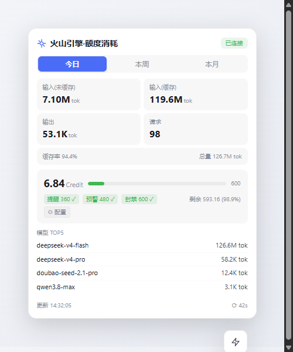

# dsh-volcengine-usage

Volcano Engine (火山引擎) API Gateway quota / usage dashboard for DeepSeek Harness (DSH) Web GUI.

A floating panel that shows real-time token consumption, estimated Credit usage, configurable daily/weekly/monthly limits — all auto-discovered from your DSH provider settings.



---

## Features

- **Auto-discovery** — scans your DSH `settings.yaml` for any gateway provider (`llm-pi-ai.providers.*` or direct style). No manual setup required.
- **Real-time KPIs** — input tokens (uncached / cached / output), request count, cache hit rate.
- **Credit estimation** — per-model daily segmented × credit_history coefficient ÷ 1e6, same algorithm as [BlueRegion Usage](https://github.com/blue-region/BlueRegionUsage).
- **Limit badges** — configurable daily warning / alert / block, weekly block, monthly block. Color-coded: safe (green) → warn (yellow) → over (red).
- **Period switch** — today / week / month, with 60s auto-refresh.
- **Theme-aware** — uses DSH platform CSS variables (`--dsw-alias-*`), adapts to light, dark, and custom themes (Endfield, Dream-Skin, etc.).
- **Click-outside-to-close** — smooth open/close animation, height transition.
- **Zero extra credentials** — reads the API key from DSH's existing credentials service, no new config surfaces.

## Installation

```bash
dsh plugin --profile desktop add github:YOUR_USERNAME/dsh-volcengine-usage
```

Or manually:

```bash
git clone https://github.com/YOUR_USERNAME/dsh-volcengine-usage.git
cd dsh-volcengine-usage
pnpm install
```

Then add `dsh-volcengine-usage` to your profile's `dsh.profile.bundles` in `package.json`, and restart DSH Desktop.

## Usage

After installation and restart, click the **lightning bolt** ⚡ icon at the bottom-right of the page to open the floating panel.

The panel shows:

| Section | Description |
|---------|-------------|
| **Connection badge** | Green "已连接" if gateway responds |
| **Period tabs** | Today / This week / This month |
| **Token KPIs** | Uncached input, cached input, output, requests, cache rate |
| **Credit card** | Estimated Credit usage, progress bar, limit badges |
| **Model TOP5** | Top 5 models by token count |

### Configuring Limits

Click the **⚙ 配置** button below the credit card to set custom limits (stored in browser localStorage):

| Limit | Default | Description |
|-------|---------|-------------|
| 日提醒 (daily warning) | 360 | Yellow threshold |
| 日预警 (daily alert) | 480 | Orange threshold |
| 日封禁 (daily block) | 600 | Red threshold |
| 周封禁 (weekly block) | 2500 | Block for the week |
| 月封禁 (monthly block) | 5000 | Block for the month |

## How It Works

```
┌───────────────────────────────────────────────────┐
│  Browser (DSH Web GUI)                            │
│  ┌────────────────┐    ┌───────────────────────┐   │
│  │  client.js      │ ←→ │  /volcengine-usage/   │   │
│  │  (floating      │    │  proxy (Node half)    │   │
│  │   panel)        │    │                       │   │
│  └──────┬─────────┘    └──────────┬────────────┘   │
└─────────┼──────────────────────────┼───────────────┘
          │                          │
          ▼                          ▼
   ┌──────────────┐         ┌──────────────────┐
   │ DSH Settings │         │ Volcano Engine   │
   │ (settings.yaml│         │ API Gateway      │
   │ + credentials)│         │ /v1/usage/*      │
   └──────────────┘         └──────────────────┘
```

The **Node half** (`lib/index.js`):
- Reads `settings.yaml` and `.credentials.yaml` from DSH home
- Auto-discovers the best gateway provider (scoring by `volceapi.com`, model count, `openai-completions` API type)
- Registers `/volcengine-usage/proxy` to forward API calls, keeping your API key server-side

The **Client half** (`lib/client.js`):
- Injects a floating panel (fixed-position, bottom-right)
- Fetches data through the proxy route (no CORS, no key exposure)
- Renders KPIs, credit chart, model list with smooth height transitions

## Development

```bash
# Build client bundle
pnpm run build:client

# Check client bundle integrity
pnpm run check:client
```

### Project Structure

```
volcengine-usage/
├── package.json          # Plugin manifest (dsh.client, dsh.bundle)
├── cordis.patch.yml      # Cordis bundle patch
├── LICENSE               # MIT
├── .gitignore
├── lib/
│   ├── index.js          # Node half (ESM) — config discovery, proxy routes
│   └── client.js         # Client bundle (__ModuleLoader__)
└── scripts/
    └── build-client.mjs  # esbuild wrapper
```

## Prerequisites

- DeepSeek Harness (DSH) 0.1.5+
- A Volcano Engine API Gateway with the [BlueRegion Usage](https://github.com/blue-region/BlueRegionUsage) backend deployed (`/v1/usage/*` endpoints)
- An API key stored in DSH's credential system (configured through the Models page)

## Compatibility

The plugin discovers providers from any DSH namespace, supporting:

- `llm-pi-ai.providers.<name>.baseURL + apiKeyEnv` (default)
- `<namespace>.baseURL + apiKeyEnv` (direct style)
- `baseURL` / `baseUrl` both accepted
- `apiKeyEnv` (credential ref) or `apiKey` (literal key)

The `/v1/usage/*` API contract follows the [BlueRegion Usage](https://github.com/blue-region/BlueRegionUsage) specification.

## License

MIT